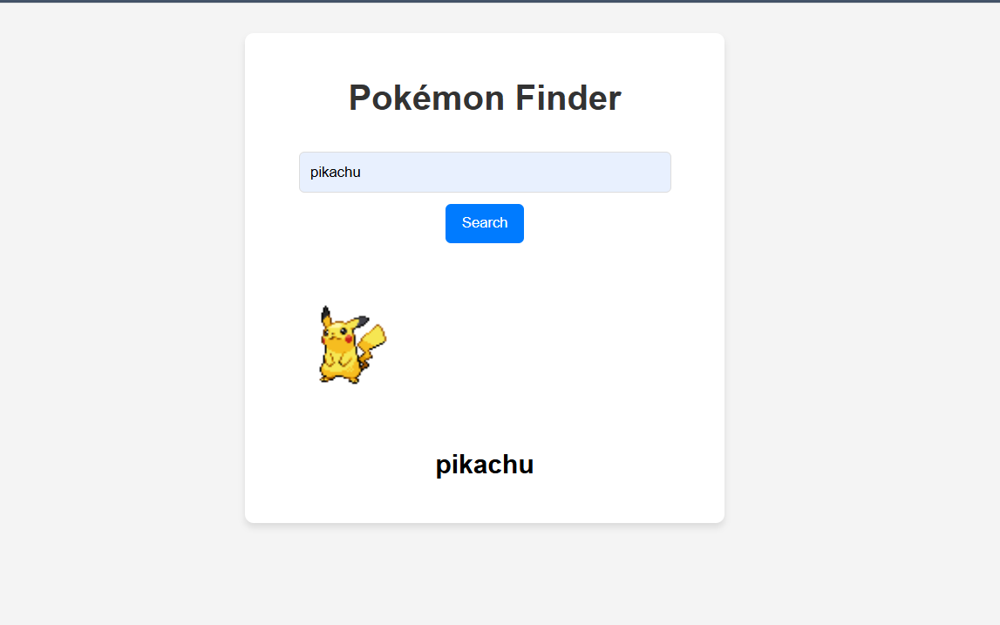

<<<<<<< HEAD
# Pokémon Finder

A simple web application to fetch and display Pokémon details using the [PokéAPI](https://pokeapi.co/).

## 🚀 Features
- Fetch Pokémon data by name.
- Display Pokémon image and name dynamically.
- Uses async/await for API requests.
- Basic error handling for invalid Pokémon names.

## 🛠 Technologies Used
- HTML
- CSS
- JavaScript (ES6+)
- PokéAPI (REST API)

## 📂 Project Structure
```
/project-folder
│── index.html      # Main HTML file
│── style.css       # Styling for the project
│── pikq.js         # JavaScript logic for fetching Pokémon data
└── README.md       # Project documentation
```

## 🎮 How to Use
1. Clone the repository:
   ```sh
   git clone https://github.com/your-username/pokemon-finder.git
   ```
2. Open `index.html` in a browser.
3. Enter a Pokémon name in the input field and click **Search**.
4. The Pokémon's name and image will be displayed.

## 📸 Preview


## 📌 Future Enhancements
- Show more details (stats, abilities, etc.).
- Add a dropdown for Pokémon suggestions.
- Improve UI with animations.

## 💡 Credits
- [PokéAPI](https://pokeapi.co/)
- Developed by **Rishabh Singh Rajawat**
